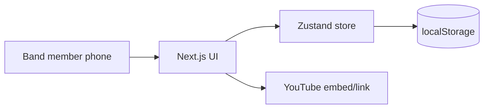

# Project Brief — Band Song Queue Tracker

## Elevator Pitch

A mobile-first web app that gives bands a shared visual queue for practice — Kanban columns from "to practice" through "performing" to "done" — with a playlist of performance-ready songs backed by YouTube proof. No signup for MVP; open on your phone at rehearsal and start dragging songs.

## Problem Statement

Cover bands and hobby groups coordinate song choices verbally, in group chats, or on paper. Practice time is wasted reconciling "what are we working on?", "who sings this?", and "is it actually ready?" There is no lightweight artifact that connects **intent** (we should learn this song) to **progress** (we're rehearsing it) to **proof** (here's a reference performance). Cost of inaction: repeated songs, neglected backlog, and setlists built from memory instead of evidence.

## Target Users & Personas

### Primary — The Practice Facilitator
Band member who runs weekly rehearsal (often drummer or guitarist). Needs a live board on their phone, fast adds, and clear status. Success = everyone knows tonight's order in 10 seconds.

### Secondary — Vocalist / Requester
Adds songs they want to sing. Cares about `singer` field visibility and seeing their requests move forward.

### Tertiary — Audience-facing member (future)
Will browse completed playlist — relevant post-MVP when share links exist.

## Value Proposition & Differentiation

- **Workflow-native:** Kanban matches how bands think (backlog → rehearsing → gig-ready), not a generic todo list.
- **Evidence-linked completion:** `done` requires YouTube — completion means performance reference exists.
- **Zero friction MVP:** No accounts, no install store — web link at practice.
- **Mobile-first DnD:** Built for touch at rehearsal, not desktop project management.

## Success Metrics

| Metric | Target | Timeframe |
|--------|--------|-----------|
| **North star:** Songs marked `done` (with valid YouTube) per week | ≥ 1–2 per active practice session | First month |
| Time to add first song (new user) | < 30 seconds | MVP launch |
| Board used across ≥ 2 practice sessions | Retention signal | 4 weeks |
| % of `done` songs with playable embed | > 90% | Ongoing |

## User Journeys (MVP)

1. **Open board at practice** → See three columns with current queue → Identify what's practicing tonight.
2. **Add a song** → Enter title, singer, who requested → Appears in `to_practice`.
3. **Start rehearsing** → Drag to `practicing` (or use status menu) → Order within column if needed.
4. **Mark performance-ready** → Drag to `done` → Prompted for YouTube URL → Validated and saved.
5. **Review setlist** → Open Playlist page → Play/browse all `done` songs.

## Functional Requirements (MVP)

| ID | Requirement | Acceptance criteria |
|----|-------------|---------------------|
| FR-01 | Kanban board with 3 fixed columns | Columns labeled; show song count per column |
| FR-02 | Display song card | Shows title, singer, addedBy |
| FR-03 | Drag-and-drop between columns | Works on touch and pointer; order preserved within column |
| FR-04 | Add song | Required: title, singer, addedBy; defaults to `to_practice` |
| FR-05 | Edit song metadata | Can update title, singer, addedBy without changing status |
| FR-06 | Delete song | Confirm or undo pattern; removed from store |
| FR-07 | Done gate | Moving to `done` requires valid YouTube URL; block save otherwise |
| FR-08 | Playlist page | Lists only `done` songs; each has working embed or external link |
| FR-09 | Persistence | Refresh browser; data remains (localStorage) |
| FR-10 | Empty states | Each column and playlist has helpful empty copy |
| FR-11 | Status change fallback | Non-drag path to change status (accessibility / awkward DnD) |

## Non-Functional Requirements

- **Performance:** Interactive drag < 100ms perceived latency on mid-range phones.
- **Security:** No secrets in client; validate YouTube URLs; no arbitrary iframe src.
- **Availability:** Static/edge-deployed SPA-style app; no hard dependency on backend for MVP.
- **Accessibility:** Keyboard/focus viable for status changes; sufficient contrast; 44px touch targets.
- **Compliance:** YouTube embeds only; no hosting of copyrighted audio.

## Growth Strategy

- **ICP:** 4–8 member hobby/cover bands with weekly practice.
- **Channels:** Direct share of URL in band WhatsApp/Telegram; facilitator as internal champion.
- **Activation:** First song added + one column transition in first session.
- **Retention:** Board becomes pre-practice ritual; playlist grows as social proof of repertoire.
- **Phase 2 loop:** Shareable public playlist URL → new bands discover via members.

## Architecture Overview

Single-page-app experience on Next.js App Router. All MVP state client-side via Zustand persist. No API layer until multi-user sync.

### Components

- **Kanban Board** — columns, sortable cards, DnD context
- **Song Card** — metadata display, drag handle, quick actions
- **Add/Edit Song Modal** — form + validation
- **Done Modal** — YouTube URL capture
- **Playlist View** — done songs + player
- **Song Store** — CRUD + move + reorder actions

### Integrations

- YouTube (URL parse + embed) — client only, MVP

### Key Technical Decisions

| Decision | Choice | Alternatives rejected |
|----------|--------|----------------------|
| State persistence | Zustand + localStorage | Supabase (too early), React Context alone (no persist ergonomics) |
| DnD library | @dnd-kit | HTML5 DnD (poor mobile), react-beautiful-dnd (deprecated) |
| Framework | Next.js App Router | Vite (acceptable if already init'd; greenfield picks Next) |
| Auth | None in MVP | Magic link / OAuth (unnecessary for single-device v1) |

## Recommended Stack

| Layer | Choice | Notes |
|-------|--------|-------|
| Framework | Next.js (App Router) | Aligns with `.claude/rules.md` |
| Language | TypeScript | Strict types for Song model |
| Styling | Tailwind CSS | Mobile-first utilities |
| State | Zustand + persist | localStorage for MVP |
| DnD | @dnd-kit/core, @dnd-kit/sortable | Touch sensors |
| Icons | lucide-react | Per PRD |
| Validation | Zod | Forms + YouTube URL |
| Deploy | Vercel | Zero-config for Next.js |

## Implementation Phases

### Phase 1 — MVP (v1)
- Scaffold Next.js + Tailwind + Zustand + dnd-kit
- Song types, store, localStorage persist
- Kanban board with add/edit/delete
- Done gate + YouTube validation
- Playlist page
- Mobile polish + empty states

### Phase 2 — Band sync
- Supabase or Firebase real-time board
- Optional auth (band invite link)
- Export/import JSON backup

### Phase 3 — Growth & polish
- Shareable public playlist
- PWA install
- Fixed member roster for `addedBy`
- Practice session history / analytics

## Out of Scope (v1)

- User authentication
- Multi-device real-time sync
- Custom Kanban columns
- Audio upload / hosting
- Gig calendar / venue management
- Comments or voting on songs
- Native mobile apps

## Risks & Mitigations

- **Data loss on browser clear** → Phase 1.5 export; clear UI disclaimer
- **YouTube URL friction** → Paste helper, accept youtu.be and watch URLs
- **DnD on small screens** → Status menu fallback
- **Feature creep** → PO guardrails in CLAUDE.md phases

## Open Questions

- Free-text vs dropdown for `addedBy` (recommend free-text MVP, dropdown Phase 2)
- Whether to clear `youtubeUrl` when moving out of `done` (recommend: keep but hide from playlist until back to done)
- Band branding / name in header (cosmetic; defer to polish step)
